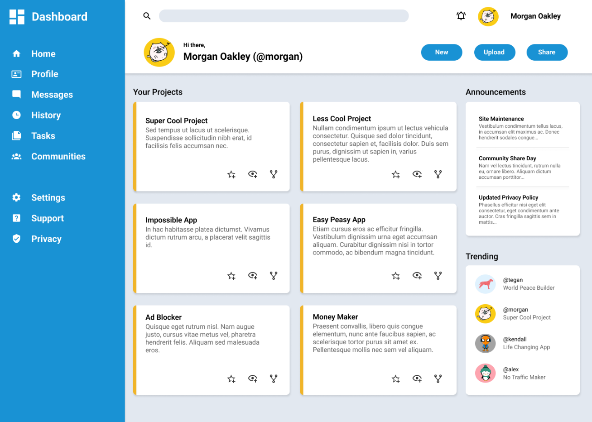

# Admin-Dashboard-Top-

This is the final project of Intermediate HTML &amp; CSS where we put into practice mixing Grid &amp; Flexbox together. 

The project instructions encouraged us to mainly recreate the grid layout(using, well, grid) but design our own visuals on top of that, however, I challenged myself to recreate the design as loyal to the original screenshot as possible.

But, why?

You see, when we bring our own ideas into reality, we tend to be forgiving: "Oh, that heading isn't where I pictured it...it looks nice anyways!" That sort of thing. So I figured, why not try to summon all of my CSS game and force myself to imitate the original design to the best of my ability? And, 50+ commits later, this is what we got:

**Aspect ratio of 5:4 = Font-sizing nightmare**

To faithfully recreate the original dashboard layout, I manually restricted the container's max-width to replicate the proportions of the reference screenshot. The screenshot had an aspect ratio of approximately 1.27:1, which is close to the old 5:4 screen format. 

While this helped match visual spacing, alignment, and general flow, it turned real estate tighter than usual, especially when dealing with SVGs and font-sizes. 

While each card or container alone looked decent, adding the text content turned into a cluttered mess that made me question my skills. It was thanks to this challenge that I learned that browsers really don't let you pass a certain point when making small fonts, because of this important little detail called: ACCESSIBILITY. Which, of course, is actually quite important! 

And yet, I wasn't about to give up, and that's when I discovered scale(), along with the transform property. And I could almost hear the angels singing until...Oopsie: Your entire layout is broken!!! Things overflowing here and there, outside content behaving differently all of a sudden and then came hours of messing around with this property without realizing what went wrong. 

But that's when ChatGPT came along and started coaching me, it explained something to me that I would have known if I hadn't just jumped into using a function without even knowing what its actually doing: *"When using scale() to shrink down an element, the element still occupies space as if it were full size. It just looks smaller."*

BINGO!!!

I said to myself: "I can work with that" And so I commented scale out for a while, stuck up with seeing the overflow its container and designed the layout thinking: "It doesn't have to look good right now, it just needs to fit right where I want it to be." 

And just like that, I managed to fit 3 containers to recreate the announcements card. After I fit that in, I just had to bring back scale() and, voila! The text was visible and looked faithful enough considering the stakes. 

Conclusion:

While there were many other challenges, font-sizing was truly the one bump that I felt was worthy of sharing. Especially as I've taken a peek into other projects and they really seem to have that same issue, even with more spacing real state.

All in all, recreating this layout by forcing myself to use this aspect ratio and leaning into using grid over flex-box, truly helped me realize the terrific potential that grid has for creating complex layouts; while it all comes down to a grid of squares, it really can make things look... `off_the_grid`.

Without further ado, I bring you a screenshot of my dashboard, followed by the original screenshot. Compare and see how closely it resembles the original!

Max Version:

Original Screenshot(The Odin Project):

